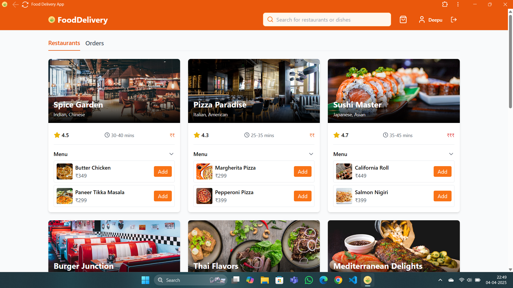
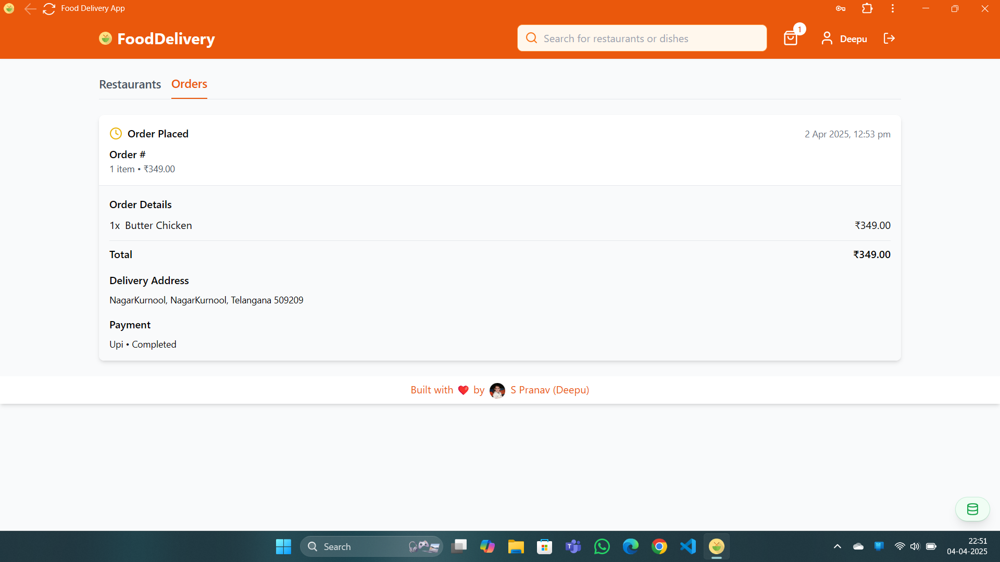

# Food Delivery Application

A full-stack MERN (MongoDB, Express, React, Node.js) application for food delivery services.

## Live link: https://deepuchary-fd.vercel.app/
## Screenshots

## Setup Instructions

### Prerequisites
- Node.js (v14 or higher)
- MongoDB (running locally or a remote connection)

### Installation

1. Clone the repository
2. Install dependencies:
   bash
   npm install
   

### Running the Application

1. Start both the backend server and frontend development server:
   bash
   npm start
   

   This will concurrently run:
   - Backend server on http://localhost:5000
   - Frontend development server on http://localhost:5173

2. Access the application at http://localhost:5173

## Features

- User authentication (register, login, logout)
- Browse restaurants and menu items
- Search functionality
- Add items to cart
- Checkout process
- Order history
- Responsive design

